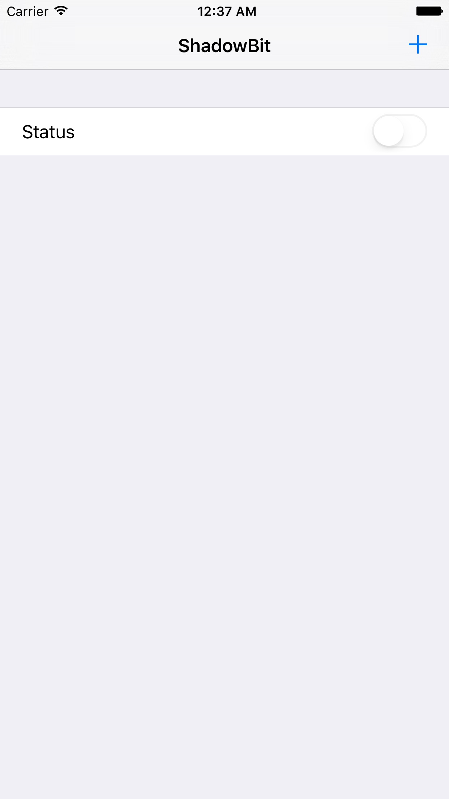
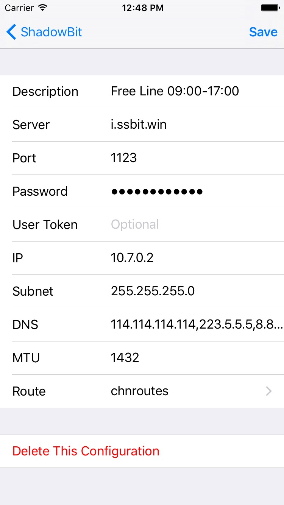
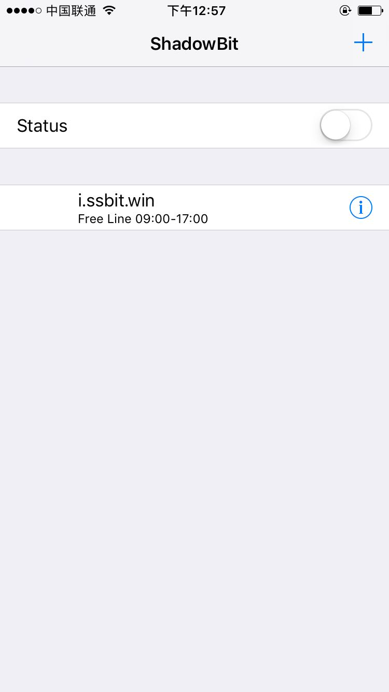
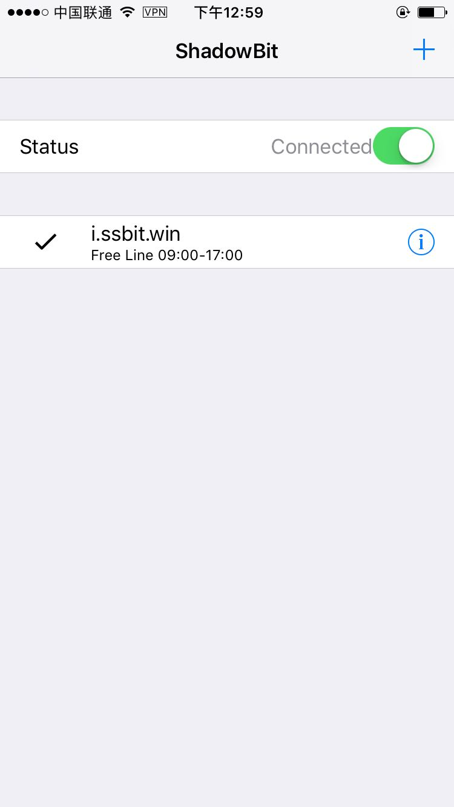

# Choose language
- [English](./en/README.md "English tutorials")
- 简体中文

# shadowbit
shadowbit 教程和免费线路

# 如何使用
- 下载安装
  - 在app store 上搜索安装 [shadowbit](https://itunes.apple.com/us/app/shadowbit/id1236116150?l=zh&ls=1&mt=8)
  - 安装后打开shadowbit，界面如下
    - 
- 添加线路
  - 点击主界面右上角的"+"按钮，出现3个选项：
    - Official Site，跳转到官网
    - Scan QR img，扫描二维码配置
    - Manually Add，手动添加配置
  - 选择“Manually Add”，跳到内置线路界面，如下：
    - 

    > 界面会弹出是否允许添加vpn配置，选择“允许 Allow” 并指纹确认或输入密码即可

  - 点击右上角的“Save”，跳转到主界面，如下：
    - 

  - 选择添加的线路，开启代理。如下图，勾选线路左边空白处，开启线路上方开关，屏幕上方出现vpn状态即表示成功。
    - 

- 测试
在浏览器中打开[google](https://google.com) [twitter](https://twitter.com) 发现一切正常！

- 说明

> 此内置线路容量将满，可能导致速度不理想。请在“更多免费线路” 中添加空闲线路

# 更多免费线路
### 正在搭建中，敬请期待......
- 日本线路
- 新加坡线路
- 国内线路（供访问B站等）

# 问题反馈
若在使用过程中碰到问题，欢迎通过以下方式向我们反馈
> 注：telegram链接需要开启代理才能访问！
- [telegram](https://t.me/joinchat/Git7-Q-mO98cqCAz406eSg)
- [github issues](https://github.com/itrump/shadowbit/issues)

# 已知问题
- 在部分网络下不能代理流量
  - 在长城宽带wifi下无法上外网
- 切换网络时需要重启
  - 在wifi/3G/4G等网络间切换时，可能会引起故障，关掉后再开启即能解决。
- 关闭后再次打开不能使用
  - 请点击对应配置的'i'图标，进入编辑配置页面，不用做改动，直接点"Save"，回到主界面再选择此配置，重新启动"Status"即可

# TODO
- [ ] add multi language tutorials
- [ ] add multi country lines
- [ ] improve ios client
